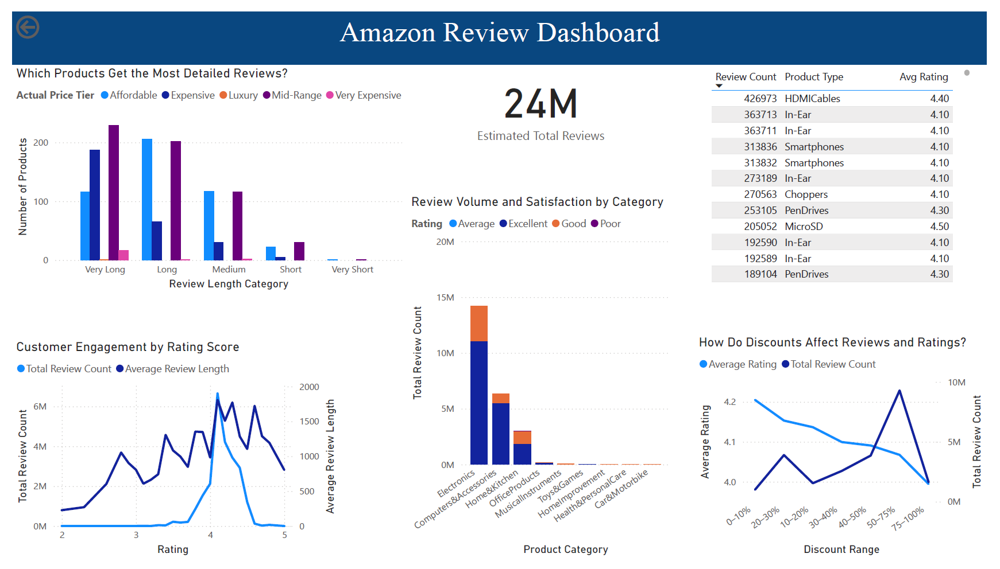

# Amazon Review Dashboard

## Objective
To explore how customers engage with Amazon products across different price tiers, categories, and discount levels. The dashboard highlights review volume, rating quality, review length, and top-performing product types.

## Dashboard Features
- Estimated total review count (24M)
- Review volume and satisfaction by **product category**
- Customer engagement trends by **rating score**
- Review detail levels based on **review length categories**
- Analysis of **discount impact** on ratings and review volume
- Top **product types** based on review volume

## Business Questions Answered
- Which products receive the most detailed reviews?
- How does actual product price influence rating and review volume?
- Are deeper discounts linked to better or worse review sentiment?
- Which categories show high customer satisfaction and engagement?
- What product types dominate Amazon’s customer attention?

## Key Insights
- **Total Review Volume**: ~24 million reviews.
- **Engagement by Rating**:
  - Most reviews fall in the 4–4.5 rating range.
  - Higher ratings are associated with longer, more detailed reviews.
- **Price Tier Behavior**:
  - Affordable (<₹1000) and Mid-Range (₹1000–₹5000) products dominate both in review count and positive sentiment.
  - Luxury (>₹100,000) and Very Expensive (₹50,000–₹100,000) tiers have very low engagement, possibly due to limited purchases.
- **Review Length**:
  - Mid-range and affordable products are most likely to receive **very long** or **long** reviews.
- **Product Category Patterns**:
  - **Electronics** dominate review count and positive ratings.
  - **Home & Kitchen** and **Office Products** follow with moderate engagement.
  - **Toys & Games**, **Musical Instruments**, and **Automotive** show low activity and satisfaction.
- **Discount Impact**:
  - Review count spikes for products discounted **50–75%**.
  - Average rating slightly drops with higher discounts, possibly due to quality compromises or expectations mismatch.
- **Top Product Insight**:
  - **HDMI Cables** (Electronics) received the most reviews (426,973) with an average rating of **4.4**.

## Recommendations

- Prioritize marketing and support for **Mid-Range and Affordable** products as they attract high engagement and satisfaction.
- Implement post-purchase follow-ups in **niche or underperforming categories** to increase review count and quality feedback.
- Monitor heavily discounted products to ensure quality isn’t compromised, especially in the 50–75% range.
- Investigate why **Luxury and Very Expensive** products receive low engagement; consider targeted review incentives or better customer experience.

## File Contents
- `AmazonReview.png`: Dashboard screenshot used in README
- `README.md`: Project summary and key findings

## ⚙️ Ranges Used in Analysis

- **Actual Price Tier (INR)**:
  - `< ₹1000`: Affordable  
  - `₹1000–₹5000`: Mid-Range  
  - `₹5000–₹50,000`: Expensive  
  - `₹50,000–₹100,000`: Very Expensive  
  - `> ₹100,000`: Luxury

- **Rating Categories**:
  - `< 2.0`: Poor  
  - `2.0–3.0`: Average  
  - `3.0–4.0`: Good  
  - `4.0–5.0`: Excellent

- **Review Length Category (words)**:
  - `< 100`: Very Short  
  - `100–250`: Short  
  - `250–500`: Medium  
  - `500–1000`: Long  
  - `> 1000`: Very Long

## Tools Used

- Power BI (visualization and dashboard design)
- Power Query (data transformation)
- Excel (initial preprocessing)

## Data Source
Amazon Sales Dataset from Kaggle: [Amazon Sales Dataset](https://www.kaggle.com/datasets/karkavelrajaj/amazon-sales-dataset)

---

> Created as part of a self-driven data analytics portfolio project. For questions or feedback, feel free to connect!
